# Meeting Audio Summary Router

Workflow file: [`workflows/meeting-audio-summary-router.json`](../workflows/meeting-audio-summary-router.json)

This workflow receives a meeting recording, transcribes it with speaker labels in AssemblyAI, and asks OpenAI for structured meeting notes. It then routes the notes one of two ways:

- **Path A (email):** sends the notes to the attendee when no follow-up appointment was agreed.
- **Path B (CRM and calendar):** when a follow-up with a specific date and time was agreed, it upserts the contact in HubSpot, logs the meeting, creates a Google Calendar event, and then emails the notes.

The workflow uses only built-in n8n nodes. AssemblyAI, OpenAI, and HubSpot are called through the plain **HTTP Request** node, so it needs no community nodes or paid n8n features.

---

## 1. Architecture

```mermaid
flowchart LR
    subgraph Intake
        WH[Webhook<br/>POST /webhook/meeting-audio] --> N[Normalize input<br/>Code]
        GDT[Google Drive Trigger<br/>disabled] -.-> GDD[Download recording<br/>disabled] -.-> N
        N --> IF1{Audio file<br/>attached?}
    end

    subgraph AssemblyAI["AssemblyAI (HTTP Request)"]
        IF1 -- yes --> UP[POST /v2/upload]
        IF1 -- "no (audio_url)" --> TR
        UP --> TR[POST /v2/transcript<br/>speaker_labels: true]
        TR --> W[Wait 15 s]
        W --> GT[GET /v2/transcript/:id]
        GT --> SW{Transcript status}
        SW -- "queued / processing" --> KP{Keep polling?<br/>under 80 checks}
        KP -- yes --> W
        KP -- no --> TO[Stop: timed out]
        SW -- error --> TF[Stop: failed]
    end

    subgraph OpenAI["OpenAI (HTTP Request)"]
        SW -- completed --> B[Build OpenAI request<br/>Code: transcript + JSON schema]
        B --> OA[POST /v1/chat/completions<br/>response_format json_schema strict]
        OA --> P[Parse AI output<br/>Code: validate, dates, email HTML]
    end

    subgraph Routing
        P --> R{Appointment detected?}
        R -- "Path B: date+time & email" --> HC[HubSpot: upsert contact]
        HC --> HM[HubSpot: log meeting]
        HM --> GC[Google Calendar: create event]
        GC --> GM[Gmail: send meeting notes]
        R -- "Path A: email known" --> GM
        R -- "no recipient" --> MR[Stop: manual review]
    end
```



### Design decisions

| Decision | Why |
|---|---|
| The webhook responds immediately (`onReceived`). | Transcription takes minutes. The caller receives `{"status":"accepted"}` and does not wait or time out. |
| AssemblyAI is polled with a Wait → GET → Switch loop. | It needs no second workflow and no public callback URL, so it also works on a localhost-only n8n. Section 4 describes the webhook-callback alternative. |
| OpenAI is called through HTTP Request with `response_format: json_schema, strict: true`. | The model must return JSON that matches the schema, so downstream nodes never parse free text. The request body is plain JSON that you can read and version, and it does not depend on the OpenAI node's version-specific options. |
| The model returns local wall-clock time (`2026-10-13T15:00`) plus an optional IANA zone, and Luxon applies the offset. | LLMs often get UTC offsets and daylight-saving changes wrong. Luxon gets them right. |
| The first Switch rule that matches wins: Path B, then Path A, then the fallback. | Each recording produces exactly one route. Path B also sends the email, so every attendee receives notes. |
| A missing recipient makes the execution **fail** rather than end silently. | The execution then appears in **Executions → Failed** and triggers your error workflow, if one is configured. The notes are still in the execution data. |
| Upload, poll, OpenAI, and HubSpot upsert have 3 retries with 5 s waits. `POST /v2/transcript` has no retries. | Retrying a create request could start duplicate (billed) transcriptions. |

### Data contract between stages

| Stage output | Key fields |
|---|---|
| Normalize input | `source` (`upload`/`url`), `audio_url`, `meeting_title`, `recipient_email`, `timezone`, `reference_datetime`, `transcript_options`, `openai_model`, binary `audio` |
| AssemblyAI: get transcript | `id`, `status`, `text`, `utterances[] {speaker, start, end, text}`, `audio_duration`, `error` |
| Build OpenAI request | `transcript_id`, `transcript_text`, `transcript_truncated`, `openai_request` |
| Parse AI output | `executive_summary`, `key_takeaways[]`, `action_items[]`, `contacts[]`, `recipient_email`, `contact`, `has_appointment`, `appointment {title, start_iso, end_iso, timezone, location, evidence, display}`, `email_subject`, `email_html`, `calendar_description`, `hubspot_contact_properties`, `hubspot_meeting_properties` |

---

## 2. Setup

### Credentials (create in n8n → Credentials)

| Credential type | Name (suggested) | Value | Used by |
|---|---|---|---|
| Header Auth | `AssemblyAI API` | Name: `Authorization`, Value: your AssemblyAI API key (no `Bearer` prefix) | upload, request transcript, get transcript |
| Header Auth | `Meeting webhook secret` | Name: `X-Webhook-Secret`, Value: a long random string | Webhook trigger |
| OpenAI API | `OpenAI` | API key | OpenAI: summarize transcript |
| HubSpot App Token | `HubSpot` | Private app access token. Scopes: `crm.objects.contacts.read`, `crm.objects.contacts.write`. | both HubSpot nodes |
| Google Calendar OAuth2 API | `Google Calendar` | OAuth client | Google Calendar: create event |
| Gmail OAuth2 API | `Gmail` | OAuth client | Gmail: send meeting notes |
| Google Drive OAuth2 API (optional) | `Google Drive` | OAuth client | Drive trigger + download (disabled by default) |

Then:

1. Import the workflow by running `.\scripts\import-workflows.ps1`, or with **Import from File** in the editor. It arrives inactive.
2. Open each node marked with a credential warning and select the matching credential.
3. Edit the `CONFIG` block at the top of **Normalize input**: `defaultTimezone`, `openaiModel`, and `defaultAppointmentMinutes`.
4. Test the workflow with **Execute workflow** and the test URL (see section 6). Then activate it.

If you prefer Outlook to Gmail, replace **Gmail: send meeting notes** with a **Microsoft Outlook → Message → Send** node and use the same `$('Parse AI output')` expressions. If you prefer Salesforce, replace the two HubSpot nodes with **Salesforce → Lead → Create or Update** followed by **Salesforce → Task/Event → Create**.

---

## 3. Node-by-node configuration

### 3.1 Receive audio (Webhook)

| Setting | Value |
|---|---|
| HTTP Method | `POST` |
| Path | `meeting-audio` → production URL `http://localhost:5678/webhook/meeting-audio` |
| Authentication | Header Auth (`X-Webhook-Secret`) |
| Respond | Immediately, with custom data `{"status":"accepted",...}` |
| Options → Field Name for Binary Data | `audio` (multipart files arrive as `audio0`, `audio1`, …) |

Accepted request fields (multipart form fields or JSON body):

| Field | Required | Meaning |
|---|---|---|
| `audio` (file) **or** `audio_url` | one of them | The recording, or a publicly reachable URL that AssemblyAI downloads itself. With a URL, the upload step is skipped. |
| `recipient_email` | no | Who receives the notes. If set, it overrides the email found in the recording. |
| `meeting_title` | no | Defaults to the file name. |
| `meeting_datetime` | no | ISO time of the meeting. Relative phrases such as "next Tuesday" are resolved against it. Defaults to now. |
| `timezone` | no | IANA zone, e.g. `America/New_York`. Defaults to `CONFIG.defaultTimezone`. |
| `speakers_expected` | no | Number of speakers. This hint improves AssemblyAI's speaker diarization. |
| `language_code` | no | e.g. `en`, `es`. If omitted, AssemblyAI detects the language automatically. |

**Alternative trigger:** The **New recording in Drive folder** node and the **Download recording** node are disabled. To use them, enable both, choose a folder, and add a Drive credential. The Drive download places the file in binary `data`, and **Normalize input** accepts any binary field name.

### 3.2 Normalize input (Code)

This node creates one consistent item from either trigger:

- It finds the audio binary, preferring `audio/*` or `video/*` MIME types, and renames it `audio`.
- It fails early if the request contains neither a file nor an `audio_url`.
- It validates the timezone and builds `reference_datetime`.
- It builds `transcript_options`: `speaker_labels: true`, `punctuate`, `format_text`, `speakers_expected` if sent, and either `language_code` or `language_detection: true`.

### 3.3 Audio file attached? (IF)

`{{ $json.source }}` equals `upload`. The **true** output goes to the upload step. The **false** output goes straight to the transcript request, which then uses `audio_url`.

### 3.4 AssemblyAI: upload audio (HTTP Request)

| Setting | Value |
|---|---|
| Method / URL | `POST https://api.assemblyai.com/v2/upload` |
| Authentication | Generic → Header Auth → `AssemblyAI API` |
| Send Body | on, Body Content Type **n8n Binary File**, Input Data Field Name `audio` |
| Timeout | 600000 ms (large files) |
| Retry on fail | 3 tries, 5 s apart |

Response: `{ "upload_url": "https://cdn.assemblyai.com/upload/..." }`

### 3.5 AssemblyAI: request transcript (HTTP Request)

| Setting | Value |
|---|---|
| Method / URL | `POST https://api.assemblyai.com/v2/transcript` |
| Body (JSON, expression) | `{{ JSON.stringify(Object.assign({}, $('Normalize input').first().json.transcript_options, { audio_url: $json.upload_url \|\| $('Normalize input').first().json.audio_url })) }}` |

Example of the body that is sent:

```json
{
  "speaker_labels": true,
  "punctuate": true,
  "format_text": true,
  "speakers_expected": 2,
  "language_detection": true,
  "audio_url": "https://cdn.assemblyai.com/upload/abc123"
}
```

Response: `{ "id": "…", "status": "queued", … }`. This step does not retry, so a network failure cannot start duplicate jobs.

### 3.6 Wait 15 seconds → AssemblyAI: get transcript → Transcript status

- **Wait:** time interval, 15 seconds.
- **Get transcript:** `GET https://api.assemblyai.com/v2/transcript/{{ $('AssemblyAI: request transcript').first().json.id }}`. It retries 3 times, so a single network error does not stop the loop.
- **Transcript status (Switch, rules mode):**
  - `completed` → **Build OpenAI request**
  - `error` → **Transcription failed** (Stop and Error, with AssemblyAI's `error` text)
  - fallback output `queued / processing` → **Keep polling?**
- **Keep polling? (IF):** `{{ $runIndex }} < 80`. The **true** output loops back to the Wait node. The **false** output goes to **Transcription timed out**.

### 3.7 Build OpenAI request (Code)

- This node turns `utterances` into lines such as `[01:05] Speaker B: …`. If diarization returned no utterances, it uses `text`.
- It truncates transcripts longer than 350,000 characters (about 90k tokens) and tells the model the transcript was truncated.
- It builds the complete Chat Completions body (section 5) and stores it as `openai_request`.

### 3.8 OpenAI: summarize transcript (HTTP Request)

| Setting | Value |
|---|---|
| Method / URL | `POST https://api.openai.com/v1/chat/completions` |
| Authentication | Predefined → OpenAI API |
| Body (JSON, expression) | `{{ JSON.stringify($json.openai_request) }}` |
| Timeout / retry | 180000 ms, 3 tries |

### 3.9 Parse AI output (Code)

- Fails clearly on a refusal (`message.refusal`), a cut-off response (`finish_reason: "length"`), or invalid JSON.
- Validates the emails. The recipient is chosen in this order: the webhook's `recipient_email`, then the model's `primary_contact_email`, then the first contact with a valid email.
- Converts `appointment.start_local`/`end_local` to ISO with the correct offset. It uses the zone stated in the recording, or the request or default zone otherwise. If no end time was given, the end is the start plus `defaultAppointmentMinutes`.
- Produces the email HTML (all model text is HTML-escaped), the calendar description, and the HubSpot property maps. Null values are omitted so they don't blank existing CRM fields.

### 3.10 Appointment detected? (Switch, first match wins)

| Output | Conditions |
|---|---|
| `Path B: CRM + calendar` | `{{ $json.has_appointment }}` is true **AND** `{{ $json.recipient_email }}` is not empty |
| `Path A: email notes` | `{{ $json.recipient_email }}` is not empty |
| `No recipient` (fallback) | → **Manual review: no recipient** (Stop and Error) |

`has_appointment` is true only when the model reported a follow-up with both a date and a time, and Luxon parsed that time successfully. A date without a time is listed as an action item instead.

### 3.11 Path B nodes

**HubSpot: upsert contact.** HTTP Request with the predefined `hubspotAppToken` credential:

```
POST https://api.hubapi.com/crm/v3/objects/contacts/batch/upsert
{ "inputs": [ { "idProperty": "email", "id": "<recipient>", "properties": { "email", "firstname", "lastname", "company", "phone", "jobtitle" } } ] }
```

If a contact with that email exists, it is updated. Otherwise a new contact is created. Its id is returned in `results[0].id`.

**HubSpot: log meeting:**

```
POST https://api.hubapi.com/crm/v3/objects/meetings
{
  "properties": { "hs_timestamp", "hs_meeting_title", "hs_meeting_start_time", "hs_meeting_end_time",
                  "hs_meeting_outcome": "SCHEDULED", "hs_meeting_location", "hs_meeting_body" },
  "associations": [ { "to": { "id": "<contact id>" },
                      "types": [ { "associationCategory": "HUBSPOT_DEFINED", "associationTypeId": 200 } ] } ]
}
```

`associationTypeId: 200` is HubSpot's default meeting-to-contact association.

**Google Calendar: create event:** calendar `primary`, start/end from `appointment.start_iso`/`end_iso`, and summary, description, and location from Parse AI output. Attendees are **not** added by default, because adding them sends Google invitations to external people. To invite the contact, add the **Attendees** field with `{{ $('Parse AI output').first().json.recipient_email }}`.

### 3.12 Gmail: send meeting notes

Both paths send through this node. Its fields read `$('Parse AI output').first().json` rather than `$json`, because on Path B the incoming item is the Calendar response:

| Field | Expression |
|---|---|
| To | `{{ $('Parse AI output').first().json.recipient_email }}` |
| Subject | `{{ $('Parse AI output').first().json.email_subject }}` |
| Email Type | HTML |
| Message | `{{ $('Parse AI output').first().json.email_html }}` |
| Append n8n attribution | off |

---

## 4. Tips for AssemblyAI async polling in n8n

1. **Poll with Wait → GET → Switch → IF.** In the IF node, `$runIndex` counts how many times that node has run in the execution, so `{{ $runIndex }} < 80` caps the loop without a separate counter.
2. **Read the job id with `$('AssemblyAI: request transcript').first().json.id`, not `$json.id`.** Inside the loop, `$json` is the previous GET response. `.first()` also avoids paired-item errors, which `.item` can produce in loops.
3. **Choose the interval to fit the audio length.** AssemblyAI usually processes audio in a fraction of real time. With 15 s × 80 checks, the loop stops after about 20 minutes, which suits recordings up to roughly 2 hours. For longer recordings, raise the limit or the interval, rather than polling faster.
4. **Waits of 65 seconds or longer are offloaded to the database.** Waits shorter than that keep the execution in memory. Both work. With long intervals, the execution survives an n8n restart.
5. **Handle every terminal status.** `completed` continues, and `error` stops with AssemblyAI's message. `queued` and `processing` are the only states that should loop, which is why they are the Switch fallback.
6. **Never retry the create call.** Retry the GET freely, but a retried `POST /v2/transcript` creates and bills a second job.
7. **Use webhook callbacks for high volume.** Add `"webhook_url": "https://<public-n8n>/webhook/assemblyai-done"` to the transcript request, and AssemblyAI will POST `{transcript_id, status}` when the job finishes. Split the workflow into two: workflow 1 ends after the request, and workflow 2 starts at that webhook, GETs the transcript, and continues from **Build OpenAI request**. You would need to pass metadata such as `recipient_email` by adding it as query parameters to `webhook_url`. This approach needs a public HTTPS n8n URL (see the README's *Public deployment* section), so the polling version is the default here.
8. **Keep recordings out of public URLs.** `/v2/upload` returns a private URL that only AssemblyAI can use. Prefer it to hosting files publicly for the `audio_url` mode.

---

## 5. OpenAI JSON payload

**Build OpenAI request** generates the following body. The prompt is abbreviated here; the full text is in the node:

```json
{
  "model": "gpt-4o",
  "temperature": 0.2,
  "response_format": {
    "type": "json_schema",
    "json_schema": {
      "name": "meeting_notes",
      "strict": true,
      "schema": {
        "type": "object",
        "additionalProperties": false,
        "required": ["meeting_title", "executive_summary", "key_takeaways", "action_items", "contacts", "primary_contact_email", "appointment"],
        "properties": {
          "meeting_title":     { "type": "string" },
          "executive_summary": { "type": "string" },
          "key_takeaways":     { "type": "array", "items": { "type": "string" } },
          "action_items": {
            "type": "array",
            "items": {
              "type": "object", "additionalProperties": false,
              "required": ["task", "owner", "due"],
              "properties": {
                "task":  { "type": "string" },
                "owner": { "type": ["string", "null"] },
                "due":   { "type": ["string", "null"] }
              }
            }
          },
          "contacts": {
            "type": "array",
            "items": {
              "type": "object", "additionalProperties": false,
              "required": ["name", "email", "phone", "company", "role"],
              "properties": {
                "name":    { "type": ["string", "null"] },
                "email":   { "type": ["string", "null"] },
                "phone":   { "type": ["string", "null"] },
                "company": { "type": ["string", "null"] },
                "role":    { "type": ["string", "null"] }
              }
            }
          },
          "primary_contact_email": { "type": ["string", "null"] },
          "appointment": {
            "type": "object", "additionalProperties": false,
            "required": ["detected", "title", "start_local", "end_local", "timezone", "location", "evidence"],
            "properties": {
              "detected":    { "type": "boolean" },
              "title":       { "type": ["string", "null"] },
              "start_local": { "type": ["string", "null"], "description": "YYYY-MM-DDTHH:mm, no offset" },
              "end_local":   { "type": ["string", "null"] },
              "timezone":    { "type": ["string", "null"], "description": "IANA zone if stated" },
              "location":    { "type": ["string", "null"] },
              "evidence":    { "type": ["string", "null"], "description": "verbatim quote" }
            }
          }
        }
      }
    }
  },
  "messages": [
    { "role": "system", "content": "You are a meeting analyst… Never invent names, emails, dates… appointment.detected is true only when a follow-up with both a date and a time is agreed… Resolve relative dates against the meeting reference date…" },
    { "role": "user", "content": "Meeting reference date/time: Monday, 2026-10-05 10:00 (America/New_York)\nTitle provided by the sender: Acme discovery\n\nTranscript:\n\"\"\"\n[00:01] Speaker A: Hi Jane, thanks for joining.\n[01:05] Speaker B: …\n\"\"\"" }
  ]
}
```

Example `choices[0].message.content`:

```json
{
  "meeting_title": "Acme discovery call",
  "executive_summary": "Jane Doe (CTO, Acme) wants a 6-week pilot…",
  "key_takeaways": ["Budget approved for Q4", "Security review required before rollout"],
  "action_items": [{ "task": "Send pilot proposal", "owner": "Sam", "due": "2026-10-09" }],
  "contacts": [{ "name": "Jane Doe", "email": "jane.doe@acme.com", "phone": null, "company": "Acme", "role": "CTO" }],
  "primary_contact_email": "jane.doe@acme.com",
  "appointment": {
    "detected": true, "title": "Pilot scoping call",
    "start_local": "2026-10-13T15:00", "end_local": null, "timezone": null,
    "location": "Zoom", "evidence": "Let's do next Tuesday at 3pm."
  }
}
```

Model notes:

- `gpt-4o` and `gpt-4o-mini` both support strict `json_schema`. To change the model, edit `CONFIG.openaiModel`.
- `gpt-3.5-turbo` does **not** support `json_schema`. If you must use it, change `response_format` to `{ "type": "json_object" }`, paste the schema into the system prompt, and expect occasional missing fields.
- Strict mode requires every property to appear in `required` and `additionalProperties: false`. Optional values are therefore expressed as `["string", "null"]`.

---

## 6. Testing

Use the test URL while the workflow is open in the editor with **Execute workflow** running. Use `/webhook/` instead once the workflow is active.

```powershell
curl.exe -X POST "http://localhost:5678/webhook-test/meeting-audio" `
  -H "X-Webhook-Secret: <your secret>" `
  -F "audio=@C:\path\to\meeting.mp3" `
  -F "recipient_email=you@example.com" `
  -F "meeting_title=Acme discovery" `
  -F "timezone=America/New_York" `
  -F "speakers_expected=2"
```

URL mode:

```powershell
curl.exe -X POST "http://localhost:5678/webhook-test/meeting-audio" `
  -H "X-Webhook-Secret: <your secret>" -H "Content-Type: application/json" `
  -d '{\"audio_url\":\"https://example.com/meeting.mp3\",\"recipient_email\":\"you@example.com\"}'
```

For your first runs, send `recipient_email` set to your own address. Path B also writes to HubSpot and your calendar, so test it with a HubSpot sandbox or test account.

## 7. Operating notes

- **Cost:** each run is billed for the audio length by AssemblyAI and for the input and output tokens by OpenAI. The webhook secret prevents anyone else from triggering paid runs.
- **Privacy:** recordings and transcripts are sent to AssemblyAI and OpenAI, and n8n stores them in execution data. Tell meeting participants that the meeting is recorded and processed, and consider enabling execution-data pruning in n8n.
- **Failures:** set an error workflow in **Workflow settings → Error workflow** to get notified about the three Stop-and-Error exits (*Transcription failed*, *Transcription timed out*, *Manual review: no recipient*) and about any API errors.
- **Review before you trust the email:** because the notes are generated automatically, keep `recipient_email` pointed at yourself until you are happy with the output quality.
